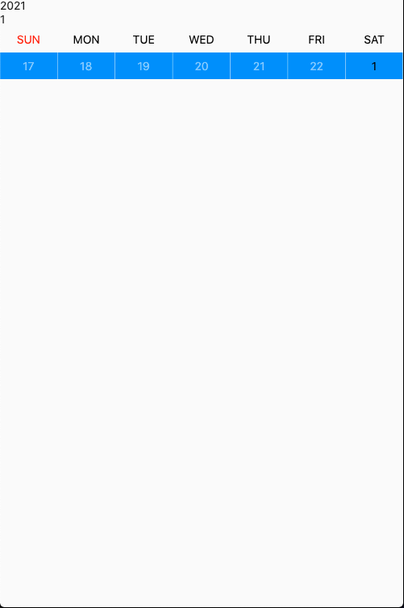
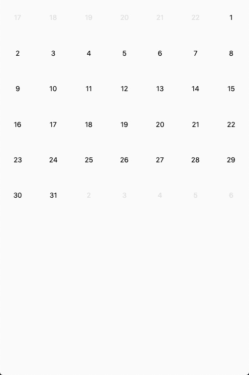

# calendar_json

create your own calendar

## Getting Started

import

```
import 'package:calendar_json/calendar_json.dart';
```

use

```dart
Calendar.json("2021-01-01")

// or 
Calendar.json(DateTime.now().toString())

// or
print(Calendar.json("2021-01-01"));


```

result:

- type 0 = date first week calculate from last mont
- type 1 = date week this now
- type 2 = date last week calculate from next first week

```json
{
    "perMonth": [
        {
            "type": 0,
            "date": 27
        },
        {
            "type": 0,
            "date": 28
        },
        {
            "type": 0,
            "date": 29
        },
        {
            "type": 0,
            "date": 30
        },
        {
            "type": 0,
            "date": 31
        },
        {
            "type": 1,
            "date": 1
        },
        {
            "type": 1,
            "date": 2
        },
        {
            "type": 1,
            "date": 3
        },
        {
            "type": 1,
            "date": 4
        },
        {
            "type": 1,
            "date": 5
        },
        {
            "type": 1,
            "date": 6
        },
        {
            "type": 1,
            "date": 7
        },
        {
            "type": 1,
            "date": 8
        },
        {
            "type": 1,
            "date": 9
        },
        {
            "type": 1,
            "date": 10
        },
        {
            "type": 1,
            "date": 11
        },
        {
            "type": 1,
            "date": 12
        },
        {
            "type": 1,
            "date": 13
        },
        {
            "type": 1,
            "date": 14
        },
        {
            "type": 1,
            "date": 15
        },
        {
            "type": 1,
            "date": 16
        },
        {
            "type": 1,
            "date": 17
        },
        {
            "type": 1,
            "date": 18
        },
        {
            "type": 1,
            "date": 19
        },
        {
            "type": 1,
            "date": 20
        },
        {
            "type": 1,
            "date": 21
        },
        {
            "type": 1,
            "date": 22
        },
        {
            "type": 1,
            "date": 23
        },
        {
            "type": 1,
            "date": 24
        },
        {
            "type": 1,
            "date": 25
        },
        {
            "type": 1,
            "date": 26
        },
        {
            "type": 1,
            "date": 27
        },
        {
            "type": 1,
            "date": 28
        },
        {
            "type": 1,
            "date": 29
        },
        {
            "type": 1,
            "date": 30
        },
        {
            "type": 1,
            "date": 31
        },
        {
            "type": 2,
            "date": 1
        },
        {
            "type": 2,
            "date": 2
        },
        {
            "type": 2,
            "date": 3
        },
        {
            "type": 2,
            "date": 4
        },
        {
            "type": 2,
            "date": 5
        },
        {
            "type": 2,
            "date": 6
        }
    ],
    "year": 2021,
    "month": 1,
    "day": 1,
    "perWeek": [
        [
            {
                "type": 0,
                "date": 27
            },
            {
                "type": 0,
                "date": 28
            },
            {
                "type": 0,
                "date": 29
            },
            {
                "type": 0,
                "date": 30
            },
            {
                "type": 0,
                "date": 31
            },
            {
                "type": 1,
                "date": 1
            },
            {
                "type": 1,
                "date": 2
            }
        ],
        [
            {
                "type": 1,
                "date": 3
            },
            {
                "type": 1,
                "date": 4
            },
            {
                "type": 1,
                "date": 5
            },
            {
                "type": 1,
                "date": 6
            },
            {
                "type": 1,
                "date": 7
            },
            {
                "type": 1,
                "date": 8
            },
            {
                "type": 1,
                "date": 9
            }
        ],
        [
            {
                "type": 1,
                "date": 10
            },
            {
                "type": 1,
                "date": 11
            },
            {
                "type": 1,
                "date": 12
            },
            {
                "type": 1,
                "date": 13
            },
            {
                "type": 1,
                "date": 14
            },
            {
                "type": 1,
                "date": 15
            },
            {
                "type": 1,
                "date": 16
            }
        ],
        [
            {
                "type": 1,
                "date": 17
            },
            {
                "type": 1,
                "date": 18
            },
            {
                "type": 1,
                "date": 19
            },
            {
                "type": 1,
                "date": 20
            },
            {
                "type": 1,
                "date": 21
            },
            {
                "type": 1,
                "date": 22
            },
            {
                "type": 1,
                "date": 23
            }
        ],
        [
            {
                "type": 1,
                "date": 24
            },
            {
                "type": 1,
                "date": 25
            },
            {
                "type": 1,
                "date": 26
            },
            {
                "type": 1,
                "date": 27
            },
            {
                "type": 1,
                "date": 28
            },
            {
                "type": 1,
                "date": 29
            },
            {
                "type": 1,
                "date": 30
            }
        ],
        [
            {
                "type": 1,
                "date": 31
            },
            {
                "type": 2,
                "date": 1
            },
            {
                "type": 2,
                "date": 2
            },
            {
                "type": 2,
                "date": 3
            },
            {
                "type": 2,
                "date": 4
            },
            {
                "type": 2,
                "date": 5
            },
            {
                "type": 2,
                "date": 6
            }
        ]
    ]
}
```
example 1 perweek

```dart

import 'package:calendar_json/calendar_json.dart';
import 'package:flutter/cupertino.dart';
import 'package:flutter/material.dart';

main() {
  runApp(Coba());
  
}

class Coba extends StatelessWidget {
  final day = <String>['Sunday', "Monday", "Tuesday", "Wednesday", "Thursday", "Friday", "Saturday" ];
  final calen = Calendar.json(DateTime.now().toString());
  @override
  Widget build(BuildContext context) {
    return Container(
      child: MaterialApp(
        debugShowCheckedModeBanner: false,
        home: Scaffold(
          body: SafeArea(
            child: Column(
              crossAxisAlignment: CrossAxisAlignment.start,
              children: [
                Text(calen['year'].toString()),
                Text(calen['month'].toString()),
                Row(
                  children: [
                    for(var dy in day)
                    Expanded(
                      child: Container(
                        padding: EdgeInsets.all(8),
                        child: Center(
                          child: Text(dy.substring(0, 3).toUpperCase(),
                            style: TextStyle(
                              color: dy == day[0]?Colors.red: Colors.black
                            ),
                          ),
                        ),
                      ),
                    )
                  ],
                ),
                Flexible(
                  child: PageView(
                    children: [
                      for(var week in calen['perWeek'])
                      Column(
                        children: [
                          Row(
                            children: [
                              for(var day in week)
                              Expanded(
                                child: Container(
                                  color: Colors.blue,
                                  padding: EdgeInsets.all(8),
                                  child: Center(
                                    child: Text(day['date'].toString(),
                                      style: TextStyle(
                                        color: day['type'] == 1?Colors.black: Colors.blue[200]
                                      ),
                                    )
                                  ),
                                ),
                              )
                            ],
                          ),
                        ],
                      )
                    ],
                  )
                ),
              ],
            ),
          ),
        ),
      ),
    );
  }
}
```




example 2 - permonth

```dart

import 'package:calendar_json/calendar_json.dart';
import 'package:flutter/cupertino.dart';
import 'package:flutter/material.dart';

main() {
  runApp(Coba());
}

class Coba extends StatelessWidget {
  final day = <String>['Sunday', "Monday", "Tuesday", "Wednesday", "Thursday", "Friday", "Saturday" ];
  final calen = Calendar.json(DateTime.now().toString());
  @override
  Widget build(BuildContext context) {
    return Container(
      child: MaterialApp(
        debugShowCheckedModeBanner: false,
        home: Scaffold(
          body: SafeArea(
            child: Column(
              crossAxisAlignment: CrossAxisAlignment.start,
              children: [
                Flexible(
                  child: GridView.count(
                    crossAxisCount: 7,
                    children: [
                      for(var cl in calen['perMonth'])
                      Container(
                        child: Center(
                          child: Text(cl['date'].toString(),
                            style: TextStyle(
                              color: cl['type'] == 1?Colors.black: Colors.grey[300]
                            ),
                          ),
                        ),
                      )
                    ],
                  ),
                )
              ],
            ),
          ),
        ),
      ),
    );
  }
}
```



